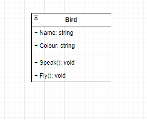
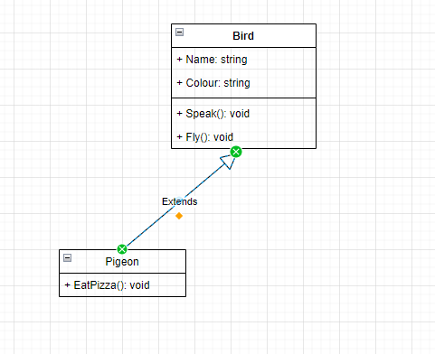
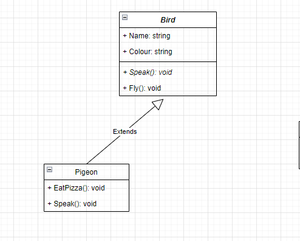
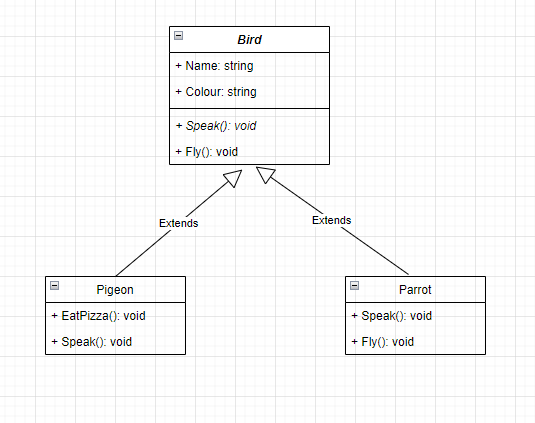
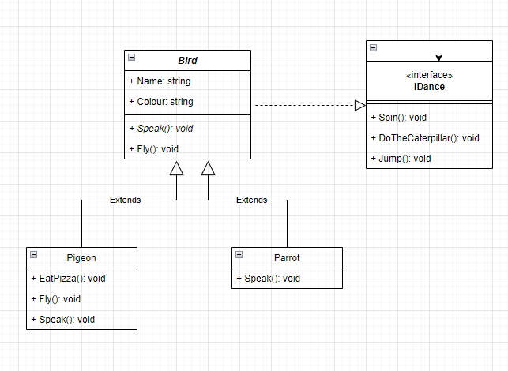

# introduction-to-oop

## Excerise 1
A class diagram representation of class contains Name, Colour properties, and Behavior of Speak and Fly.

## Excerise 2
Inheritance, when a class takes its attributes and behaviour from the parent class.

## Excerise 3
Overriding the class from the parent class

## Exercise 4
Abstraction, when a class has unimplemented method, because the implementation is required by the consuming class. Hiding complexity from the user while providing their implementation of the behaviour of the class.

## Exercise 5
Multiple inheritance problem introduces diamond of dead problem, which is when inherited with multiple class, which constructor to invoke. It is solved by the interface, which is like a pure abstract class, also known as contract. It is a composition, which has the behaviors.

